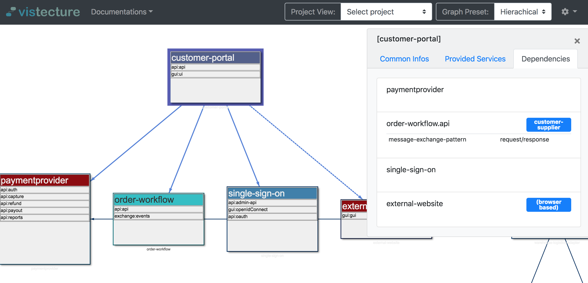
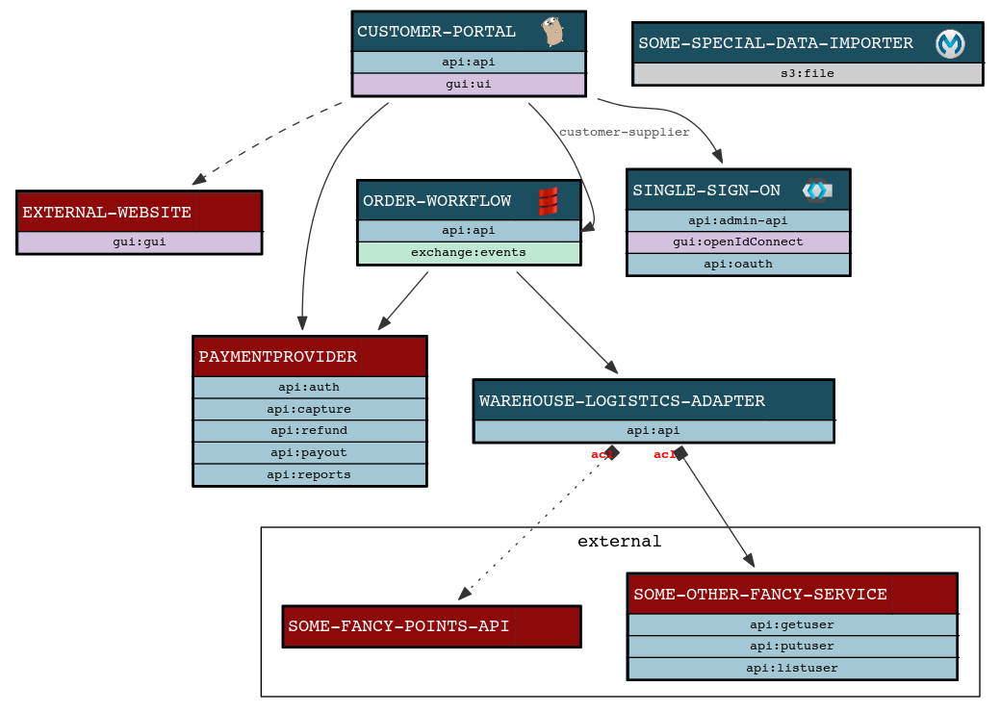

# vistecture: Service Architecture Tool

A tool for visualizing and analyzing distributed (micro) service oriented architectures.
Just define your applications (microservices) with its dependencies in a simpel yaml file.

You can use the online browser:


Or you can use it to render graphviz based images and any kind of text documentations.



## Define your application architecture:

Describe your architecture in YAML in a machine readable format and generate various documentation artefacts out of it.

For an example see the "demoproject" in the example folder.

You can put your definition in one (big) file or split it up in  multiple files in structured directories (which is preferred for structuring bigger definitions).

It is also possible to use json instead of yml if you like.


## Installation Options:
### Go Get

```
go get github.com/AOEpeople/vistecture
```
### Use a Docker container

It has graphviz and vistecture installed and can be used directly:
```
docker pull aoepeople/vistecture
```

Example usage with a definition from current folder:
```
cd /your/path/with_vistecture_defintions

docker run -v $(pwd):/workspace -p 8080:8080 aoepeople/vistecture vistecture --config=/workspace serve

docker run -v $(pwd):/workspace aoepeople/vistecture  vistecture --config /workspace analyze

docker run -v $(pwd):/workspace aoepeople/vistecture  sh -c "vistecture --config /workspace/definition graph --iconPath /usr/src/go/src/github.com/AOEpeople/vistecture/templates/icons | dot -Tpng -o /workspace/graph.png"
```


### Or Download Binaries
You can also download a published release from github:

E.g. for mac:
(For linux use "vistecture-linux" and for windows "vistecture.exe")

```
curl -LOk "https://github.com/AOEpeople/vistecture/releases/download/0.2.beta/vistecture"
chmod +x vistecture

# download the templates
curl -LOk "https://github.com/AOEpeople/vistecture/releases/download/0.2.beta/templates.zip"
unzip templates.zip

```


And then discover the command:

```
vistecture help
```

You can also clone the repository and use golang tools.


## Vistecture Configuration Format:

Vistecture need a Project Configuration and multiple Application configurations:

### Project Configuration

The project configuration can be used to:

- load the list of applications (key "appDefinitionsPaths") this can be path to a folder or concrete file that contain the **application configuration**

Here is an example:

```yaml
projectName: "Demoproject"
appDefinitionsPaths:
- external-services
- service-group-1
- service-group-2
appOverrides:
- name: customer-portal
  add-provided-services:
  - name: loyalty
    type: gui
    dependencies:
    - reference: order-workflow
subViews:
- name: "Demoproject minimal"
  included-applications:
  - customer-portal
  - single-sign-on
  - order-workflow

```

### Application Configuration

```yaml
name: service1
group: group1
technology: scala
team: team1
display:
  bordercolor: "#c922b3"
summary: Short description
properties:
  foo: bar
  my-version: 0.1.latest
description: |
  Use markdown to describe the service.
  * one
  * tow
provided-services:
  - name: someApi
    type: api
  - name: otherApi
    type: api
  - name: eventpublish
    type: exchange
infrastructure-dependencies:
  - type: mysql
- name: application
  group: group1
  description: Application Description
  provided-services:
    - name: userinterface
      type: gui
      description: Main Application UI
      dependencies:
        - reference: service1.someApi
          relationship: partnership
          description: Some description here
    - name: api
      type: api
    - name: domainEventAdapter
- name: service2
  title: Service 2
  category: core
  description: Framework, Technical Details, Database Access
  dependencies:
    - reference: service1
- name: service3
  title: Service 3
  category: group1
  description: Interface for administration
- name: service4
  title: Service 4
  category: group1
  description: Individual System
  status: planned
```

Please also see chapter 'Domain Language / Concepts' for more information

## Usage Options

### Run Browser based view:
```
> vistecture --config=pathtodefinitions serve
```
or

### Generate Graphs:

A main feature is generating graphviz compatible graph descriptions that can be used by any of the graphviz layouters like this:

Complete Graph:
```
> vistecture --config=pathtodefinitions graph | dot -Tpng -o graph.png
```

Graph for a dedicated project configuration:
```
> vistecture --config=pathtodefinitions graph --projectname=nameoftheproject | dot -Tpng -o graph.png
```

Graph for one application and its direct dependencies (including infrastructure dependencies):
```
> vistecture --config=pathtodefinitions graph --application=applicationame | dot -Tpng -o graph.png
```

The generation of the graph can add small icons to the applications. Therefore the tool looks in `iconPath` for a .png file matching the defined "technology".

***Team Graphs***
You can also draw the resulting relationships between the teams:
```
> vistecture --config=pathtodefinitions teamGraph  --summaryRelation 1 | dot -Tpng -Gbgcolor=white -o teamgraph.png
```

### Generate documentations:
You can also render a documentation - expecting the dot command is executable for the application it will embed svg images:

```
> vistecture --config=pathtodefinitions documentation > documentation.html
```
The rendering needs a go html template. The "template" folder comes with a nice example.
You can download the templates to your local filesystem and use or modify them.

E.g.:

```
> vistecture --config=pathtodefinitions documentation --templatePath=$GOPATH/github.com/AOEpeople/vistecture/templates/htmldocument.tmpl > documentation.html
```

### Other artefacts:
Check for cyclic dependencies and get a very basic impact analysis:

```
> vistecture --config=pathtodefinitions analyze
```

## Concepts and the Domain Language of the Service definition:

This tool defines:

**Project:**
A project defines which applications to be included for processing at runtime.
In general, a project acts as an repository "overwrite" to minimize configuration effort.

If no project or no "included applications" are configured, all available applications in the repository will be taken.
If multiple projects are available and no one is explicit mentioned in the commanline call, the first found will be taken.

The "included-applications" container references defined applications by name but can overwrite all other root attributes
of an applpication like title, properties etc.

**Application:**
A Application is normally something that offers one or more service-components (or interfaces).
Normally a Application is something that is deployed separate - and has a separate build and integration pipeline.

- Supported Categories: external (rendered in red)
- Supported Technologies: go, scala, magento, akeneo, php, anypoint, keycloak (they will get a nice icon)

**Service:**
An Application offers services (more specific service components - but we use services here).
An application can offer one or more services.
Services are used by other systems or humans.

Service Properties:
- isPublic: They can be public or just internal.
- isOpenHost: The service is a well designed published API
- securityLevel: Classification of the API in regard of security (public, internal, confidential, restricted)
- dependencies: Array of Dependency

**Dependency:**
A Application or a service can have dependencies.
You can define dependency on application or also on service level (to emphasize that the dependency is only required for a certain service.)
A dependency creates a reference to either a application - or more exact to a service. The relation is of a certain relationship type. You can also add a description to explain more details to this dependency.

Dependency Properties:
- reference: String in the format "Applicationname.Servicename" (Servicename is optional)
- relationship: String - defining the collaboration level between the two bounded contexts / relationship. (See below)
- isSameLevel: Boolean. Use this to influence graph formatting - to emphasise that the services are semantically on the same level
- resilience: String. Define the implemented resilience pattern
- isBrowserBased: If the dependency is established in the browser (and not from the backend.) This results in a dashed line.

**supported relationship types:**
- partnership: Very close collaboration
- customer-supplier: (use this where a strong dependency exists that the supplier delivers whats required by the customer. A stronger collaboration between the teams of the components need to exist.)
- conformist: (use this to emphasise also a strong dependency that we need the services provided. But there is no chance to influence the interface - so the downstream component is forced to be conform to whatever is provided - and need to make it work.)
- (please note that on a per service level it is possible to define the service as isOpenHost - this normaly means that the applications consuming this services fall in the relationship "open-host")
- acl: (Anti corruption layer: If the provided interface is complex or very different from the applications bounded context internal model. The acl emphasizes that the downstream component takes care to isolate his domain with a acl pattern)

(See https://www.aoe.com/tech-radar/strategic-domain-driven-design.html )

**Groups (Business Services):**
Applications can be grouped. This can for example be used to visualize Business Services:

Several service components are typically composed to business services.
For example an ecommerce shop business service may consist of services from  ecommerce application, login application, search application.


## Todos

-  [ ] Better Impact Analysis for application failures - including resilience evaluation
-  [ ] Generate useful artifacts for infrastructure pipeline (e.g. consul acls, service discovery tests...)

## Development

```
go get github.com/AOEpeople/vistecture
cd github.com/AOEpeople/vistecture

//run tests
go test ./tests/...

//build binaries:
make all

// releasing: docker publish
// push changes to github /
// adjust version number in Makefile (!!)  and run
make dockerpublish

```
