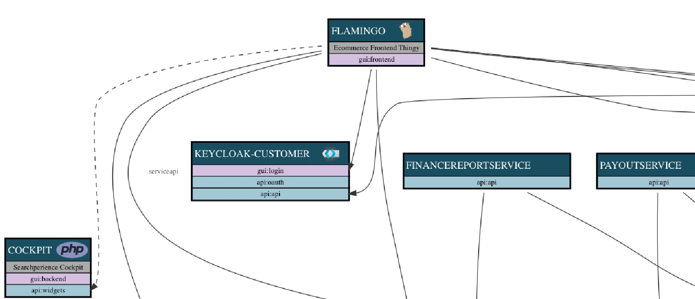

# vistecture: Service Architecture Tool

A tool for visualizing and analyzing distributed (micro) service oriented architectures.



## Define your application architecture:

Describe your architecture in JSON. You can do this in two ways
- one json file or
- in multiple json files that are all in one directory. (prefered for structuring bigger definitions)

### Installation:

Download a published release from github:

E.g. for mac:
(For linux use "vistecture-linux" and for windows "vistecture.exe")

```
curl -LOk "https://github.com/AOEpeople/vistecture/releases/download/0.2.beta/vistecture"
chmod +x vistecture

# dowload the templates
curl -LOk "https://github.com/AOEpeople/vistecture/releases/download/0.2.beta/templates.zip"
unzip templates.zip

```


And then discover the command:

```
vistecture help
```

You can also clone the repository and use golang tools.


### Example project definition (json):

```
{
  "name": "my application suite",
  "applications": [
    {
      "name":  "application1",
      "group": "Optional a Group",
      "technology": "scala",
      "category": "Optional a category"
      "description": "Some short description / New line",
      "summary": "Optional shorter summary",
      "display":{
        "bordercolor": "#3971ad"
      },
      "provided-services": [
        {
            "name": "auth",
            "type": "api",
            "description": "A description of the service",
            "isPublic": true,
            "dependencies": [
              {
                "reference": "application2"
              }
            ]
        }
      ],
      "infrastructure-dependencies": [
        {
          "type": "redis"
        }
      ],
      "dependencies": [
          {
            "reference": "keycloak.login",
            "relationship": "serviceapi",
            "isSameLevel": false,
            "isBrowserBased": true,
            "resilience": true
          }
      ]
    }
    "business-services": [
        {
            "name": "eshop",
            "references": [
                "application1",
                "application2"
            ]
        }
      ],

    ...

```


## Usage

Currently the main feature is generating graphviz compatible graph descriptions that can be used by any of the graphviz layouters like this:

Complete Graph
```
> vistecture --config=pathtojson graph | dot -Tpng -o graph.png
```

Graph for one Application and its direct dependencies (including infrastructure dependencies):
```
> vistecture --config=pathtojson graph --application=applicationame | dot -Tpng -o graph.png
```

You can also render a documentation - expecting the dot command is executable for the application it will embedd svg images:

```
> vistecture --config=pathtojson documentation > documentation.html
```

Check for cyclic dependencies and get a first impact analysis:

```
> vistecture --config=pathtojson analyze
```

## Domain Language / Concepts:

This tool defines:

**Application:**
A Application is normaly something that offers one or more service-components (or interfaces).
Normaly a Application is something that is deployed seperate - and has a seperate build and integration pipeline.

- Supported Categories: external (rendered in red)
- Supported Technologies: go, scala, magento, akeneo, php, anypoint, keycloak (they will get a nice icon)

**Service:**
An Application offers services (more specific service components - but we use services here).
An application can offer one or more services.
Services are used by other systems or humans. They can be public or just internal.

**Dependency:**
A Application or a service can have dependencies. You can add dependency on service level to emphazize that the dependency is only required for a certain service.
(This is used for impact analyses).
A depdendency creates a reference to either a application - or more exact to a service. The relation is of a certain relationship type.

**supported releationship types:**
- customer-supplier: (use this where a strong dependency extsis that the supplier delivers whats required by the customer. A stronger collaboration between the teams of the components need to exist.)
- openhost: The used api is designed for integration. Its nice and offers multiple services and the format well thought. Most modern Rest API should fall under this section. This is the default
- published-language:  (like openhost + documentation / api formats are published (documented) )
- conformist: (use this to emphazise also a strong dependency that we need the services provided. But there is no chance to influence the interface - so the downstream component is forced to be conform to whatever is provided - and need to make it work.)
- acl: (Anti coruption layer: If the provided interface is complex or very different from the applications bounded context internal model. The acl emphazizes that the downstream component takes care to isolate his domain with a acl pattern)

(See https://www.aoe.com/tech-radar/strategic-domain-driven-design.html )

**Business Services:**
Several service components are typically composed to business services.
For example an ecommerce shop business service may consist of services from  ecommerce application, login application, search application.


## Todos

-  [X] Graph for single application including infrastructure
-  [ ] Introduce useful resilience pattern types for the dependencies
-  [ ] Introduce Business Services as Composite of Services
-  [ ] Better Impact Analysis for application failures - inlcuing resilience evaluation
-  [ ] Create complete documentation
-  [ ] Generate useful artefacts for infrastructure pipeline (e.g. consul acls, service discovery tests...)

## Development

Use "make all" to build the binaries.

To run test:`

```
go test ./tests/...
```


## Tip

Disable CSP Header in Jenkins to allow inline styles (required for a direct view of the generated documentation as jenkins artefact)
Open Jenkins script console and type:

```
System.setProperty("hudson.model.DirectoryBrowserSupport.CSP", "")
```